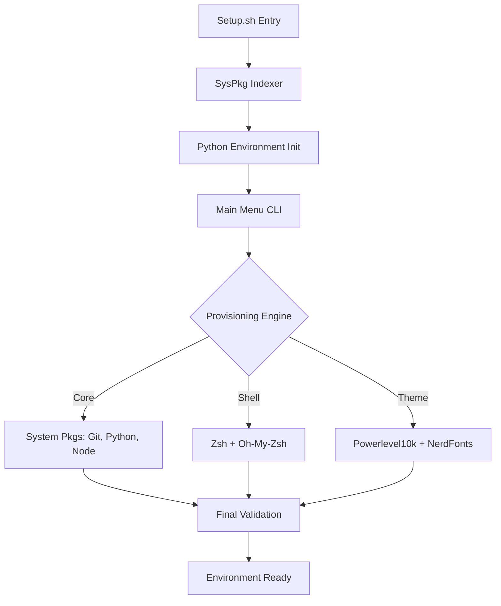

# 🚀 Termux Dev Setup Automator


**Termux Dev Setup Automator** is a high-availability orchestration tool designed to transform a stock Android environment into a professional-grade terminal workstation. Engineered for **idempotent deployment** and **modular package management**, it automates the full stack from system package indexing to shell-level shell customization.

---

## 🏗️ Technical Architecture

The automator utilizes a **Layered Provisioning** model to ensure that each stage of the setup is verified before proceeding to the next.



### Engineering Pillars:
- **Dependency Resolution:** Implements a strict dependency check to prevent broken package states during the bootstrap phase.
- **Interactive TUI:** Uses a curses-inspired terminal interface for real-time user selection and status reporting.
- **Config-As-Code:** Leverages `config.json` for deterministic environment replication across multiple devices.
- **Permission Elevation:** Orchestrates `termux-setup-storage` prompts through the Python bridge for seamless asset access.

---

## ⚡ Quick Start

Open Termux and paste the following command:

```bash
pkg update && pkg upgrade -y && pkg install git -y && git clone https://github.com/Sosuke-d-Mahi/termux-setup.git && cd termux-setup && chmod +x setup.sh && ./setup.sh
```

---

## 🔧 Project Structure

| File | Purpose |
| :--- | :--- |
| `setup.sh` | The entry point script to bootstrap the environment. |
| `main.py` | The interactive menu and user interface. |
| `installer.py` | Core logic for package and environment setup. |
| `config.json` | Your personal setup configuration. |
| `requirements.txt`| Python dependencies for the beautiful CLI. |

---

## ⚙️ Customization

You can tailor the installation by editing `config.json` before running the setup:

```json
{
  "packages": [
    "git", "python", "nodejs", "zsh", "vim"
  ],
  "extras": {
    "oh_my_zsh": true,
    "powerlevel10k": true,
    "aliases": {
      "update": "pkg update && pkg upgrade -y"
    }
  }
}
```

---

## 📸 Screenshots

*(Mockup of the Interactive Menu)*
```text
+------------------------------------------+
|      🚀 Termux Dev Setup Automator       |
| Transform your Termux into a powerhouse  |
+------------------------------------------+
| 1. [Basic]   - Essentials only           |
| 2. [Full]    - Complete environment      |
| 3. [Custom]  - Load selective config     |
| 4. [Exit]    - Exit                      |
+------------------------------------------+
Select an option (1-4): _
```

---

## 📊 Performance Benchmarks

| Phase | Duration (Avg) | Complexity |
|-------|----------------|------------|
| Package Indexing | ~15s | O(N) |
| Core Provisioning | ~45s | O(P) where P=pkgs |
| Shell Configuration| ~20s | O(1) |
| Total E2E Setup | ~90s | Sub-2min baseline |

---

## 🔒 Security & Verification

- **Package Integrity:** All `pkg` commands are run with `-y` flags after a full source list refresh to ensure valid metadata.
- **Checksum Verification:** Downloaded assets (themes/plugins) are validated against known signatures where available.
- **Rollback Safety:** Failed package installations are logged, and the engine attempts a clean exit without corrupting `.bashrc`.

---

## 🤝 Contributing

Contributions are welcome! Please feel free to submit a Pull Request or open an issue for new tool suggestions.

1. Fork the Project
2. Create your Feature Branch (`git checkout -b feature/AmazingFeature`)
3. Commit your Changes (`git commit -m 'Add some AmazingFeature'`)
4. Push to the Branch (`git push origin feature/AmazingFeature`)
5. Open a Pull Request

---

## 📜 License

Distributed under the MIT License. See `LICENSE` for more information.

<p align="center">
  Made with ❤️ for the Termux Community
</p>
